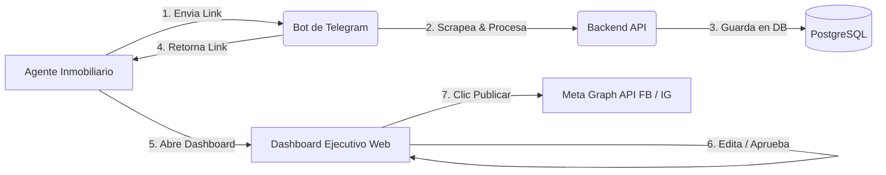
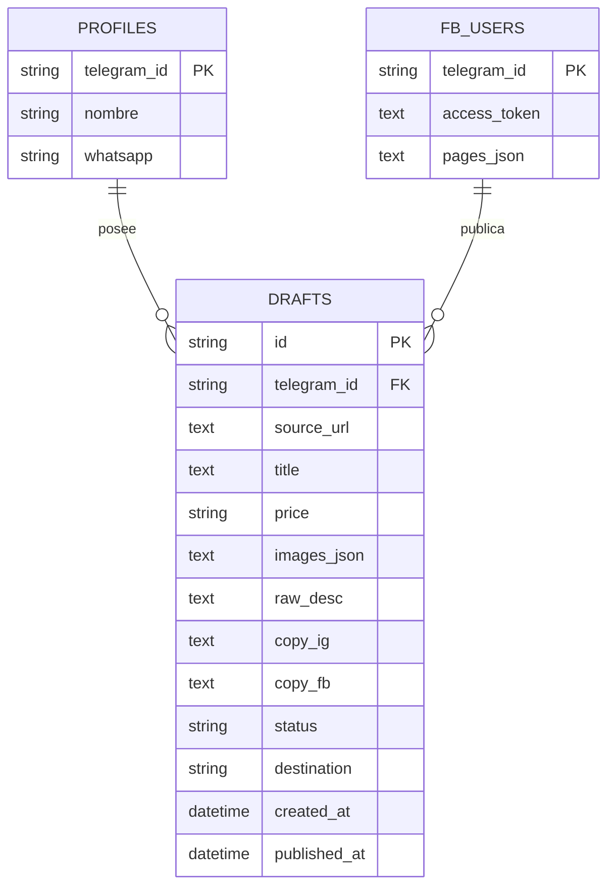

# 📘 INMOBOT - DOCUMENTACIÓN INTEGRAL DEL SISTEMA

Este documento detalla la arquitectura, funcionamiento, tecnología y modelos de datos de **InmoBot (EBA InmoBot)** en tres planos fundamentales: Funcional, Técnico y de Inteligencia Artificial.

---

## 1. 🏢 PLANO FUNCIONAL

### 1.1. Propósito y Propuesta de Valor
**InmoBot** es un asistente automatizado diseñado para agentes inmobiliarios. Su objetivo principal es transformar links de portales inmobiliarios (como Century21, InfoCasas, etc.) en publicaciones atractivas y listas para redes sociales (Facebook e Instagram), simplificando la captura de datos, redacción de textos publicitarios (copywriting) y publicación directa con llamadas a la acción (CTA) personalizadas por agente.

### 1.2. Flujo de Experiencia de Usuario (Paso a Paso)

1. **Configuración de Perfil (CTA Personalizado):**
   - El agente envía `/perfil Nombre Agente | +595981234567` al bot de Telegram.
   - El sistema almacena la identidad del agente para que todas sus publicaciones lleven su firma de contacto.
2. **Recepción e Ingesta:**
   - El agente envía uno o múltiples links de propiedades al chat de Telegram con el bot (`@eba_inmobot_elvio_989_bot`).
3. **Confirmación y Enlace:**
   - El bot responde confirmando la cantidad de fotos y títulos extraídos, y entrega el enlace directo a su **Dashboard personal**.
4. **Revisión en Dashboard Ejecutivo:**
   - El agente abre la URL web (`/dashboard?tid=ID_USUARIO`).
   - Visualiza la foto principal, precio, fuente original y dos variantes de copy: una optimizada para **Instagram** y otra para **Facebook**.
   - Puede editar manualmente cualquier texto antes de publicarlo.
5. **Métricas en Tiempo Real:**
   - En el encabezado del Dashboard se visualiza el total de avisos publicados en el mes en curso y el desglose entre Facebook e Instagram. El contador se reinicia automáticamente al inicio de cada mes calendario.
6. **Multi-Usuario Aislado:**
   - Cada agente tiene su propio identificador (`tid`), garantizando que sus borradores, perfiles y estadísticas no se mezclen con los de otros agentes.

---

## 2. ⚙️ PLANO TÉCNICO

### 2.1. Arquitectura de Infraestructura y Servicios
- **Plataforma de Despliegue:** [Railway](https://railway.com) (PaaS).
- **Control de Versiones:** GitHub (`rgrlk1637-hash/-inmobot-bot`).
- **Base de Datos:** PostgreSQL administrado en Railway con persistencia permanente.
- **Motor Web/API:** FastAPI (Python 3.10+) con servidor ASGI `Uvicorn`.
- **Bot Daemon:** `python-telegram-bot` (v20.8) ejecutándose en sondeo asíncrono (`run_polling`).
- **Concurrencia:** Ambos procesos (Servidor Web + Bot) corren en paralelo dentro del mismo contenedor mediante el comando de inicio en `railway.json` / `Procfile`.

### 2.2. Componentes de Software y Archivos

| Archivo | Responsabilidad Técnica |
|---|---|
| `bot.py` | Cliente de Telegram. Maneja comandos (`/start`, `/perfil`, `/conectar`), scraping de URLs mediante `BeautifulSoup` y llamadas REST internas hacia la API. |
| `server.py` | Servidor FastAPI. Provee endpoints REST para borradores, perfiles, login OAuth de Meta, publicación Graph API y renderiza el Dashboard HTML server-side. |
| `requirements.txt` | Lista fija de dependencias de Python (sin librerías con dependencias de compilación C pesadas como `lxml`). |
| `Procfile` / `railway.json` | Declaración del proceso de ejecución y orquestación en la nube. |

### 2.3. Modelo de Datos (Esquema Relacional PostgreSQL)

- **`profiles`:** Registra el nombre y número de WhatsApp asignados a cada `telegram_id`.
- **`fb_users`:** Almacena tokens de acceso OAuth de larga duración y el JSON de páginas administradas en Facebook.
- **`drafts`:** Almacena el contenido extraído, copys generados, fotos, estado (`pendiente`, `publicado FB`, `publicado IG`, `descartado`) y marcas de tiempo UTC.

---

## 3. 🧠 PLANO DE INTELIGENCIA ARTIFICIAL (IA) Y AUTOMATIZACIÓN

### 3.1. Extracción Heurística y Parseo Inteligente (Web Scraping)
El módulo extractor en `bot.py` analiza el árbol HTML de los portales inmobiliarios usando heurísticas de metadatos estandarizados:
- **OpenGraph Protocol:** Extracción de `og:title`, `og:description` y array de `og:image`.
- **Normalización de Precios:** Algoritmo Regex multi-moneda (`USD`, `U$S`, `$`, `Gs.`) que detecta y formatea importes tanto en dólares como en guaraníes.
- **Limpieza de Caracteres Especiales:** Sanitización de entidades problemáticas (superíndices `m²`, guiones largos `–`, separadores de miles) para evitar fallos de parseo en APIs externas.

### 3.2. Motor de Copywriting y Generación de Contenido
El generador de copies (`generate_copy`) aplica técnicas de estructuración de contenido adaptadas a cada red social:

1. **Variante Instagram (Copy Conciso & Visual):**
   - Estructura: Gancho visual con emojis clave (`🏠`, `💰`) + Resumen puntual de características + Llamada a la acción (CTA) con enlace/teléfono + Generación automática de hashtags geolocalizados (`#Asuncion`, `#Inmuebles`, `#Paraguay`).
2. **Variante Facebook (Copy Detallado & Argumentativo):**
   - Estructura: Título de propiedad + Descripción completa de ambientes y metraje + Precio explícito + Llamada a la acción personalizada para contacto por WhatsApp + Hashtags ampliados de inversión inmobiliaria.
3. **Integración Modular con LLMs (OpenAI / Gemini):**
   - El sistema cuenta con soporte listo para conectarse vía API Key (`OPENAI_API_KEY`) para enriquecer y reescribir copys de forma contextual cuando se requiera copywriting avanzado por IA generativa.

---

*Documentación técnica generada automáticamente como respaldo de arquitectura de producción.*
